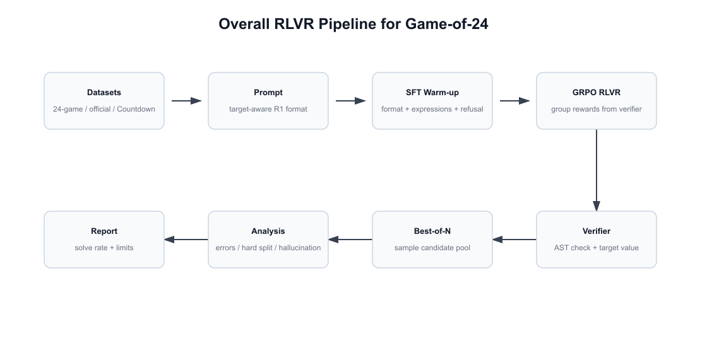
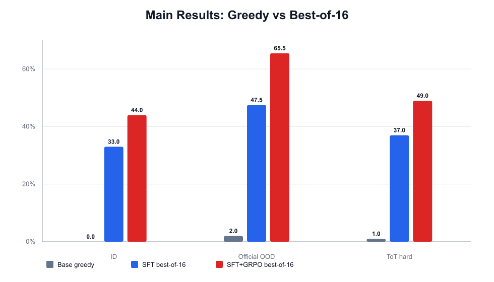
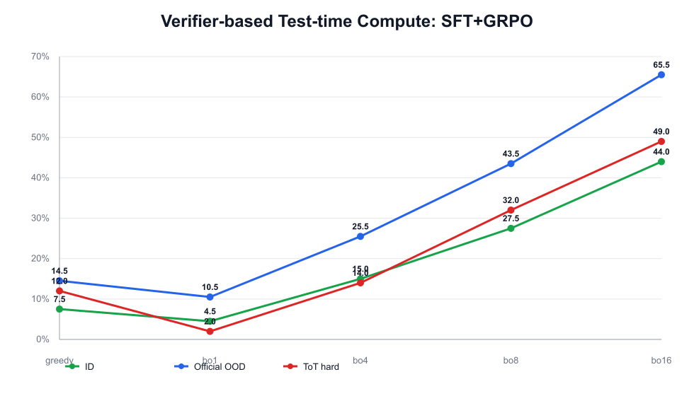
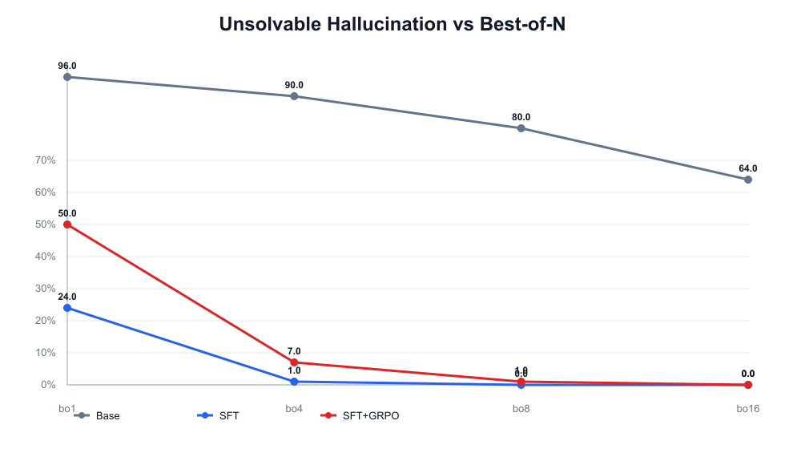
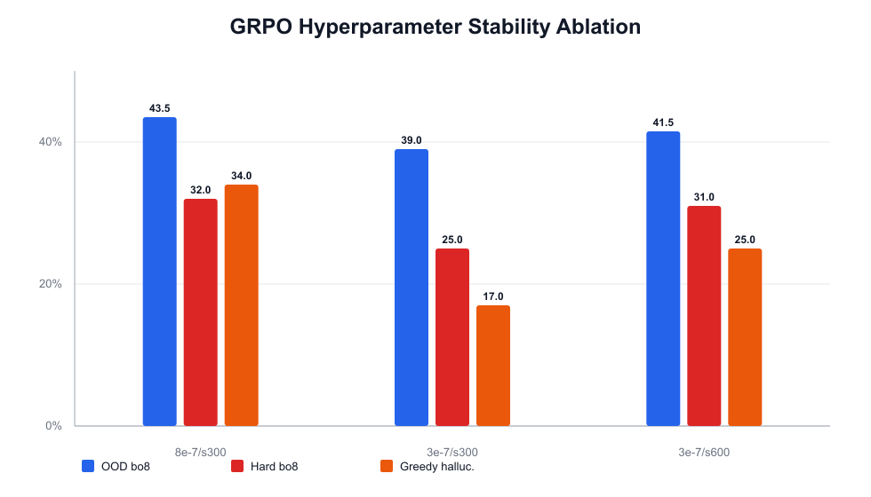
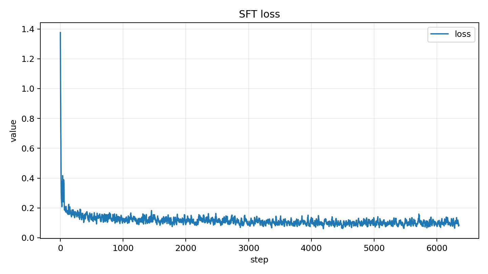
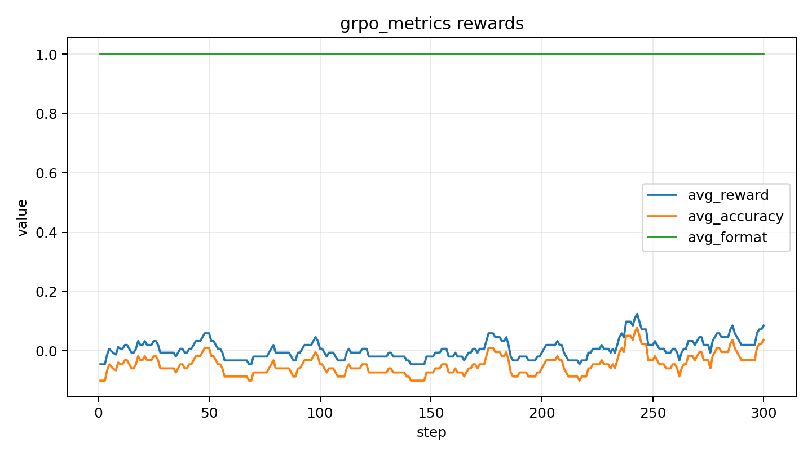
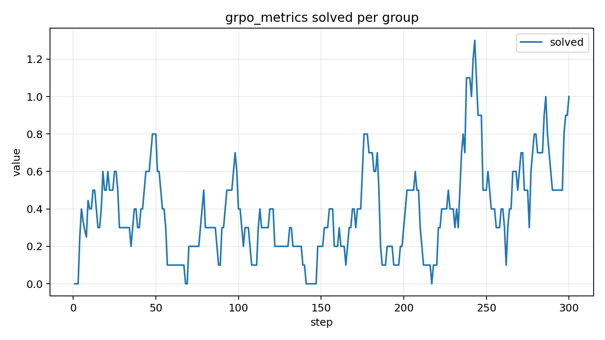
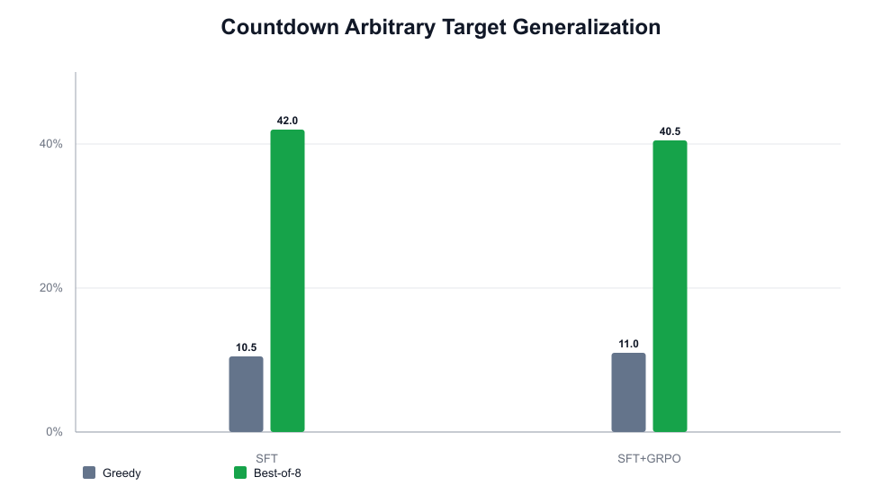

# 基于 GRPO 与可验证奖励的 24 点游戏求解实验报告

## 摘要

本项目面向 24 点游戏构建了一个可验证奖励强化学习（RLVR）实验系统。给定 4 个 1-13 之间的整数，模型需要按照 `<think>...</think><answer>...</answer>` 格式输出一个只使用四则运算和括号的表达式，并且每个输入数字恰好使用一次、结果等于 24。实验以 `Qwen2.5-1.5B-Instruct` 为主线，采用 SFT warm-up 建立基本表达式生成能力，再使用 GRPO 进行可验证奖励强化学习。

最终结果显示，`SFT+GRPO + verifier best-of-16` 在 Official OOD split 上达到 **65.5%**，在 Tree of Thoughts hard split 900-1000 上达到 **49.0%**，不可解样本幻觉率为 **0.0%**。除主任务外，项目还将验证器、prompt 与 reward 扩展为 target-aware 形式，在 Countdown 任意目标数任务上完成加分项验证。

## 1. 引言与贡献

24 点游戏是一个典型的小规模组合推理任务。它既要求模型理解自然语言 prompt，又要求模型完成离散搜索、算术计算和格式约束。更重要的是，答案是否正确可以由程序严格验证，因此它非常适合作为 RLVR 场景：不需要人工偏好标注，也不需要训练额外奖励模型。

本项目的主要贡献如下：

1. 构建了 `Qwen2.5-1.5B-Instruct` 的完整训练闭环：base evaluation、SFT warm-up、SFT 后 GRPO continuation。
2. 将 24 点任务统一建模为 `(numbers, target) -> expression`，使同一套 verifier/reward 可迁移到 Countdown 任意目标数任务。
3. 显式引入不可解样本评估，将模型“会不会解题”和“会不会拒绝乱编”同时纳入评价。
4. 使用 verifier-based test-time compute，将模型输出建模为候选表达式生成，并用程序验证器筛选正确解。
5. 对结果进行错误类型、hard split 难度和 GRPO 超参稳定性分析，避免只报告单一准确率。



## 2. 任务定义与挑战分析

### 2.1 任务定义

24 点主任务输入为 4 个整数：

```text
numbers = [a, b, c, d],  a,b,c,d in {1, ..., 13}
target = 24
```

模型输出必须满足：

```text
<think>reasoning process</think>
<answer>expression</answer>
```

其中 `expression` 只能包含输入数字、四则运算符 `+ - * /` 与括号。验证器检查三类约束：

1. 数字使用约束：每个输入数字必须且只能使用一次。
2. 语法安全约束：表达式只允许四则运算和括号。
3. 目标值约束：表达式计算结果与 target 的误差不超过 `1e-6`。

对于不可解输入，模型应输出 `NO_SOLUTION`，而不是强行编造表达式。

### 2.2 主要挑战

**组合搜索空间大。** 24 点求解涉及数字排列、运算符选择和括号结构组合。模型需要隐式完成离散搜索，而不是简单记忆答案。

**奖励稀疏。** 只有完整表达式通过验证器时才获得准确率奖励，部分正确的中间步骤通常无法直接得分。

**格式与语义双重约束。** 模型既要遵守 R1 风格输出模板，又要保证 `<answer>` 内表达式真实可执行、可验证。

**不可解样本存在幻觉风险。** 大语言模型倾向于生成看似合理的答案。对不可解样本，如果没有单独建模，模型可能始终输出一个错误表达式。

**强化学习训练不稳定。** GRPO 可以提升候选池质量，但也可能扰动 SFT 后的拒答行为，导致 greedy 下 hallucination 上升。

## 3. 问题建模与创新设计

### 3.1 Target-aware 统一建模

本项目没有将验证器写死为 24，而是将任务统一表示为：

```text
(numbers, target) -> expression
```

24 点是 `target=24` 的特例。Countdown 任务则使用每条样本自己的 target，因此 prompt、reward、verifier 和 evaluation 均可复用。这使系统从固定 24 点求解器扩展为通用的小规模算术目标构造器。

### 3.2 Verifier-based RLVR

奖励不依赖人工标注或奖励模型，而由程序验证器直接给出。验证器基于 AST 安全解析表达式，过滤非法语法、非法数字使用和错误结果。这样的奖励完全可复现，也避免了自然语言奖励模型在算术任务上的不稳定判断。

### 3.3 不可解样本的 Hallucination 建模

本项目将不可解样本作为独立 split。若模型在不可解题中输出错误表达式，则记为 hallucination；若输出 `NO_SOLUTION` 或等价拒答，则视为正确拒答。该设计把任务从“只求解可解题”扩展为“求解与可解性判断”的联合问题。

### 3.4 Verifier-based Test-time Compute

单次 greedy 输出无法充分反映模型候选池中的潜在能力。为此，本项目在测试时采样多个候选，并用验证器选择第一个正确表达式。该过程等价于：

```text
language model -> candidate pool -> verifier selection
```

这与 Tree of Thoughts 和 TinyZero 的思想一致，但实现更轻量：不需要人工打分，也不需要额外搜索模型。

## 4. 方法

### 4.1 Prompt 与输出格式

训练和评估均使用 R1 风格模板：

```text
<think>
可以写出简短推理过程。
</think>
<answer>
(1+2+3)*4
</answer>
```

评估时只验证 `<answer>` 中的表达式。这样既保留 reasoning 格式，又避免将自然语言推理文本纳入算术验证。

### 4.2 安全表达式验证器

验证器执行以下步骤：

1. 从 completion 中抽取 `<answer>`。
2. 若答案为 `NO_SOLUTION`，进入不可解样本拒答判断。
3. 使用 AST 解析表达式，拒绝函数调用、变量、列表等非四则运算语法。
4. 统计表达式中出现的数字，与输入 multiset 精确匹配。
5. 计算表达式值，判断是否满足 `abs(value - target) <= 1e-6`。

### 4.3 奖励函数

GRPO 训练使用格式奖励和准确率奖励的加权组合：

```text
R = w_f R_format + w_a R_accuracy
```

其中 `R_format` 检查 `<think>` 与 `<answer>` 标签是否完整，`R_accuracy` 检查答案是否通过验证器。对于不可解样本，正确拒答获得正向奖励，乱编表达式受到惩罚。

### 4.4 SFT Warm-up

直接对基础模型做 GRPO 容易学到格式捷径，例如只输出固定标签或固定数字。为缓解稀疏奖励问题，本项目先使用可验证表达式进行 SFT warm-up，使模型具备：

1. 稳定输出 R1 格式的能力；
2. 生成合法表达式的基本能力；
3. 在不可解样本上输出拒答的能力。

SFT 后再进行 GRPO，强化学习主要用于改善候选表达式质量，而不是从零学习格式。

### 4.5 GRPO 训练

GRPO 对同一个 prompt 采样一组候选，根据组内相对奖励计算优势。设同组奖励为 `r_1, ..., r_G`，则第 `i` 个候选的优势为：

```text
A_i = (r_i - mean(r)) / (std(r) + epsilon)
```

训练流程如下：

```text
for prompt in training_prompts:
    candidates = sample(model, prompt, G)
    rewards = [verifier_reward(c) for c in candidates]
    advantages = normalize_within_group(rewards)
    update_policy_with_GRPO(candidates, advantages)
```

本项目主线使用 `GRPO_SAMPLES=300`、`GRPO_GENERATIONS=8`，并补充低学习率对照以分析训练稳定性。

### 4.6 Best-of-N Verifier 解码

评估阶段的 best-of-N 不改变模型参数，只增加测试时采样候选数：

```text
for problem in test_set:
    candidates = sample(model, problem, N)
    for candidate in candidates:
        if verifier(candidate) == correct:
            return candidate
    if problem is unsolvable and any candidate is NO_SOLUTION:
        return NO_SOLUTION
    return failed
```

该方法将语言模型作为候选生成器，将精确验证交给程序完成。

## 5. 实验设置

### 5.1 数据集与评估 Split

| Split | 来源 | 用途 | 规模 |
| --- | --- | --- | ---: |
| ID | `nlile/24-game` held-out | 分布内可解题评估 | 200 |
| Official OOD | `test-time-compute/game-of-24` | 官方分布外泛化评估 | 200 |
| ToT hard 900-1000 | official benchmark indices 900:1000 | Tree of Thoughts 常用难题 | 100 |
| Unsolvable | `nlile/24-game` 不可解样本 | 幻觉检测 | 100 |
| Countdown | `Jiayi-Pan/Countdown-Tasks-3to4` | 任意目标数加分项 | 200 |

Official OOD 和 ToT hard 来自同一个 official game-of-24 benchmark。ToT hard 是其中 indices 900-1000 的 100 道困难题，平均官方 solved rate 更低、平均 rank 更高。

### 5.2 训练配置

| 项目 | 设置 |
| --- | --- |
| Backbone | `Qwen2.5-1.5B-Instruct` |
| 参数高效微调 | LoRA |
| 主线流程 | base eval -> SFT warm-up -> GRPO continuation |
| SFT 学习率 | `8e-5` |
| GRPO 主线学习率 | `8e-7` |
| GRPO prompt 数 | 300 |
| GRPO num generations | 8 |
| 解码方式 | greedy, best-of-1/4/8/16 |

### 5.3 评价指标

| 指标 | 含义 |
| --- | --- |
| Solve rate | 表达式合法、数字使用正确且结果等于 target 的比例 |
| Format rate | 输出是否满足 `<think>...</think><answer>...</answer>` |
| Hallucination rate | 不可解样本上仍输出错误表达式的比例 |
| Error counts | `format_error`、`number_mismatch`、`wrong_value`、`invalid_expression` 等错误计数 |
| Difficulty | official benchmark 的 `solved_rate` 与 `rank` 聚合 |

## 6. 实验结果与分析

### 6.1 主结果：Base vs SFT vs SFT+GRPO

| 模型阶段 | 解码 | ID | Official OOD | ToT hard | 不可解幻觉 | Format |
| --- | --- | ---: | ---: | ---: | ---: | ---: |
| Base | greedy | 0.0% | 2.0% | 1.0% | 100.0% | 49.0% |
| Base | best-of-8 | 1.5% | 3.0% | 1.0% | 80.0% | 42.5% |
| SFT | greedy | 4.0% | 11.0% | 10.0% | 4.0% | 100.0% |
| SFT | best-of-8 | 22.0% | 31.0% | 13.0% | 0.0% | 100.0% |
| SFT+GRPO | greedy | 7.5% | 14.5% | 12.0% | 34.0% | 100.0% |
| SFT+GRPO | best-of-8 | 27.5% | 43.5% | 32.0% | 1.0% | 100.0% |
| SFT+GRPO | best-of-16 | **44.0%** | **65.5%** | **49.0%** | **0.0%** | 100.0% |



基础模型几乎无法稳定完成任务，且不可解样本幻觉率达到 100%。SFT 后 format rate 达到 100%，不可解幻觉显著下降，说明 warm-up 解决了格式和拒答基础能力。GRPO 在 greedy 下提升有限，但在 best-of-N 下显著提升 OOD 和 hard split，说明它主要改善候选池质量。

### 6.2 Verifier-based Test-time Compute

| 解码 | ID | Official OOD | ToT hard | 不可解幻觉 |
| --- | ---: | ---: | ---: | ---: |
| greedy | 7.5% | 14.5% | 12.0% | 34.0% |
| best-of-1 | 4.5% | 10.5% | 2.0% | 50.0% |
| best-of-4 | 15.0% | 25.5% | 14.0% | 7.0% |
| best-of-8 | 27.5% | 43.5% | 32.0% | 1.0% |
| best-of-16 | **44.0%** | **65.5%** | **49.0%** | **0.0%** |



best-of-N 是本项目最明显的增益来源。对 `SFT+GRPO`，Official OOD 从 best-of-1 的 10.5% 提升到 best-of-16 的 65.5%，ToT hard 从 2.0% 提升到 49.0%。这说明模型单次输出仍不稳定，但候选池中已经包含大量可由 verifier 筛出的正确表达式。

### 6.3 不可解样本 Hallucination 分析



不可解样本用于检查模型是否会强行编造答案。Base 在 best-of-1 到 best-of-16 下幻觉率仍高达 96.0% 到 64.0%。SFT 显著改善拒答能力，best-of-8 后幻觉率降为 0.0%。`SFT+GRPO` 的 greedy 幻觉率升至 34.0%，说明 RL 更新会扰动拒答行为；但 verifier best-of-16 最终将幻觉率降到 0.0%。

### 6.4 GRPO 训练稳定性与超参对照

| GRPO 配置 | Greedy OOD | Greedy hard | Greedy 幻觉 | Best-of-8 OOD | Best-of-8 hard | Best-of-8 幻觉 |
| --- | ---: | ---: | ---: | ---: | ---: | ---: |
| `8e-7/s300/g8` | 14.5% | 12.0% | 34.0% | **43.5%** | **32.0%** | 1.0% |
| `3e-7/s300/g8` | 13.0% | 11.0% | **17.0%** | 39.0% | 25.0% | **0.0%** |
| `3e-7/s600/g8` | **15.0%** | 11.0% | 25.0% | 41.5% | 31.0% | 2.0% |



低学习率能缓解 greedy 下的不可解幻觉，其中 `3e-7/s300` 将 greedy 幻觉率从 34.0% 降至 17.0%。但主线 `8e-7/s300/g8` 在 best-of-8 的 OOD 与 ToT hard 上仍最强。因此最终采用主线配置作为主要结果，并将低学习率实验作为训练稳定性分析。

### 6.5 训练曲线







SFT loss 持续下降，说明 warm-up 阶段稳定学习了输出格式和表达式模式。GRPO 的 reward 与 solved per group 存在波动，符合强化学习训练不稳定的预期。主线 GRPO 最后 50 step 的平均 reward 为 0.0412，平均 solved per group 为 0.66，说明训练后期候选池中正确表达式比例有所增加。

### 6.6 错误类型分析

以最终 `SFT+GRPO + best-of-16` 为例，主要错误如下：

| Split | 主要错误 |
| --- | --- |
| ID | `wrong_value=74`, `refusal_or_no_answer=38` |
| Official OOD | `wrong_value=38`, `refusal_or_no_answer=31` |
| ToT hard | `wrong_value=38`, `refusal_or_no_answer=12`, `invalid_expression=1` |
| Unsolvable | `refused=100` |

SFT 后格式错误基本消失，剩余错误主要是 `wrong_value`，即表达式合法但计算结果不等于目标值。这说明瓶颈已经从“格式学习”转向“算术搜索与组合推理”。在不可解 split 上，最终配置 100 个样本全部拒答，说明 verifier-based selection 能有效抑制幻觉。

### 6.7 Hard Split 难度分析

| Split | 样本数 | 官方平均 solved rate | 平均 rank | SFT+GRPO best-of-16 |
| --- | ---: | ---: | ---: | ---: |
| Official OOD | 200 | 96.98% | 100.5 | 65.5% |
| ToT hard 900-1000 | 100 | 85.88% | 950.5 | 49.0% |

ToT hard 来自 official benchmark 的 indices 900-1000，平均 rank 明显更高，官方 solved rate 更低，因此比普通 OOD 更困难。模型在 hard split 上仍达到 49.0%，说明 verifier best-of-N 不只提升简单题，也能提升困难组合题表现。

### 6.8 Countdown 加分项

Countdown 任务将输入扩展为 3-4 个数字和任意 target，用于验证 target-aware 框架是否可迁移。

| 模型阶段 | 解码 | Countdown solve | Format |
| --- | --- | ---: | ---: |
| SFT | greedy | 10.5% | 100.0% |
| SFT | best-of-8 | **42.0%** | 100.0% |
| SFT+GRPO | greedy | 11.0% | 100.0% |
| SFT+GRPO | best-of-8 | 40.5% | 100.0% |



Countdown 结果证明同一套 prompt、target-aware verifier 和 reward 可以迁移到任意目标数构造任务。best-of-8 相比 greedy 提升明显，但小规模 Countdown GRPO 未超过 SFT best-of-8，因此该部分更适合作为框架迁移验证，而不是声称 GRPO 在 Countdown 上带来显著增益。

## 7. 局限性

1. **Greedy 成功率仍低。** 最终模型 greedy OOD 只有 14.5%，说明模型尚未稳定内化完整算术搜索策略。
2. **Best-of-N 带来额外推理成本。** best-of-16 显著提升性能，但每题需要采样更多候选。
3. **GRPO 会扰动拒答能力。** 主线 GRPO greedy hallucination 从 SFT 的 4.0% 升至 34.0%，需要 verifier 或更保守超参控制。
4. **Countdown GRPO 增益有限。** Countdown 上 SFT best-of-8 为 42.0%，SFT+GRPO best-of-8 为 40.5%，说明任意目标任务仍需要更充分训练。
5. **训练规模较小。** 主线 GRPO 只使用 300 prompts，结果更适合作为小规模 RLVR 验证，而非性能上限。

## 8. 结论

本项目完成了基于 `Qwen2.5-1.5B-Instruct` 的 24 点游戏 RLVR 实验。SFT warm-up 解决了基础模型格式不稳和不可解幻觉问题，GRPO 进一步提升了候选池质量，而 verifier-based best-of-N 将 OOD 和 hard split 表现显著放大。最终 `SFT+GRPO + best-of-16` 在 Official OOD 上达到 65.5%，在 ToT hard 上达到 49.0%，不可解幻觉率为 0.0%。

从建模角度看，项目不只是复现 GRPO，而是围绕 24 点任务补充了 target-aware 扩展、不可解幻觉评估、test-time verifier selection、错误类型诊断和 hard split 难度分析。这些设计使实验结果更可解释，也更适合作为 RLVR 在小规模可验证推理任务上的完整案例。

## 9. 附录：复现命令与结果路径

### 9.1 主线实验

```bash
export PYTHONPATH=$PWD
export QWEN_15B=/path/to/Qwen2.5-1.5B-Instruct

N_EVAL=200 N_HARD=100 BEST_OF=8 GRPO_SAMPLES=300 GRPO_GENERATIONS=8 \
  bash scripts/run_15b_mainline.sh "$QWEN_15B" 0
```

### 9.2 Best-of-N Sweep

```bash
N_EVAL=200 N_HARD=100 BEST_OF_LIST="1 4 8 16" \
  bash scripts/run_ttc_sweep.sh "$QWEN_15B" 0
```

### 9.3 Countdown 加分项

```bash
COUNTDOWN_TRAIN=3000 COUNTDOWN_EVAL=200 BEST_OF=8 GRPO_SAMPLES=300 GRPO_GENERATIONS=8 \
  bash scripts/run_countdown_bonus.sh "$QWEN_15B" 0
```

### 9.4 关键结果路径

| 内容 | 路径 |
| --- | --- |
| 1.5B base 评估 | `results/game24-15b-base/` |
| 1.5B SFT 评估与曲线 | `results/game24-sft-15b-curriculum/` |
| 1.5B SFT+GRPO 评估与曲线 | `results/game24-grpo-15b-curriculum/` |
| GRPO 超参对照 | `results/game24-grpo-15b-lr3e-7-s300/`, `results/game24-grpo-15b-lr3e-7-s600/` |
| Countdown 加分项 | `results/countdown-sft-15b/`, `results/countdown-grpo-15b/` |
| 报告图表 | `docs/report/figures/` |

早期 0.5B direct GRPO 和 3B 预实验保留在 `results/` 中作为探索过程归档。由于训练协议不同，它们不作为正式模型规模对照。
